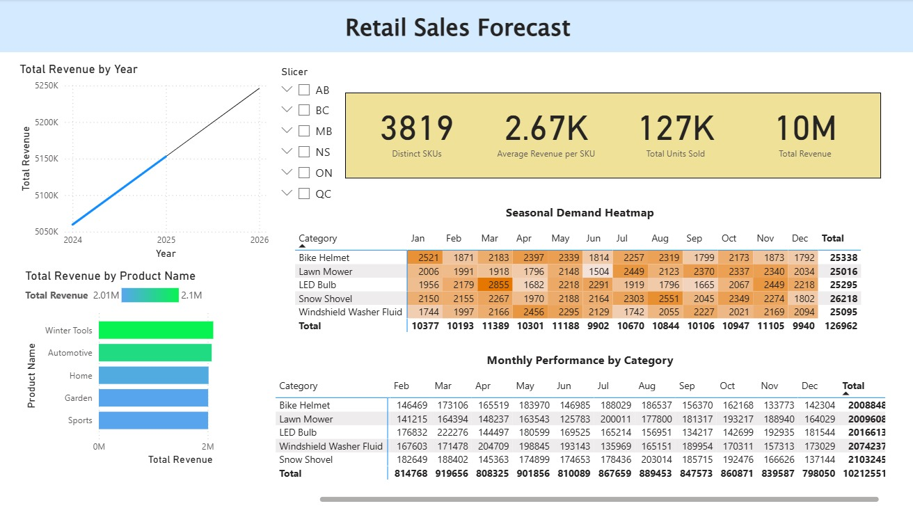

# 🛒 Retail & Sales Forecasting Dashboard (Power BI)

**Project Duration:** Dec 2024 – Jan 2025  
**Tool Used:** Power BI, Excel  
**Author:** Vaishnav Vadrevu

---

## 📌 Project Overview

This project simulates retail sales data to analyze SKU-level performance, revenue trends, and seasonal demand patterns. The dashboard supports decision-making around inventory planning, product performance, and forecasting future sales.

---

## 📊 Key Features

- **Interactive Power BI Dashboard**
  - Total Revenue and Units Sold KPIs
  - Top 10 SKUs by Revenue
  - Monthly Revenue Trends (with Forecast)
  - Category-wise Sales Breakdown
  - Seasonal Performance Matrix

- **Forecasting**
  - Built-in Power BI forecasting on revenue trends using DateTable
  - Simulates demand prediction for better inventory insights

- **Dataset**
  - 5,000+ rows of randomly generated sales data across 2 years
  - Includes SKUs, revenue, product categories, stores, and provinces

---

## 📁 Project Files

| File | Description |
|------|-------------|
| `/Dataset/Retail_Sales_Forecasting_Dataset.xlsx` | Simulated sales data |
| `/PowerBI/Retail_Sales_Forecasting.pbix` | Final Power BI dashboard file |
| `/Screenshots/*.png` | Preview images of the dashboard |

---

## 🧠 Skills Demonstrated

- Data modeling (star schema)
- DAX measures (Revenue, Units, SKU-level metrics)
- Forecasting and trend analysis
- Visual design and layout best practices
- Time intelligence using custom Date Table

---

## 📸 Sample Dashboard Preview

---

## 🚀 How to Use

1. Open `Retail_Sales_Forecasting.pbix` in Power BI Desktop
2. Explore filters and visuals interactively
3. Customize for your own company/product dataset if needed

---

## 📬 Contact

If you liked this project or have feedback, feel free to reach out via [LinkedIn](https://www.linkedin.com/in/vaishnav-vadrevu).

